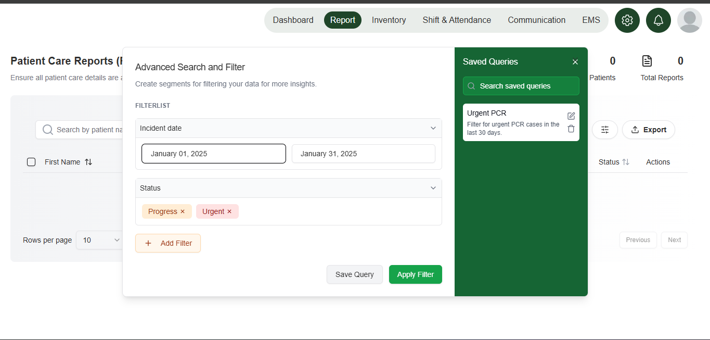

# 🚑 Rescue Track Frontend

[](https://nextjs.org/)
[](https://reactjs.org/)
[](https://www.typescriptlang.org/)
[](https://tailwindcss.com/)
[](LICENSE)

A comprehensive **Rescue Track Management System** web application built with Next.js and React, providing emergency services with advanced patient care reporting, inventory management, and administrative tools for healthcare professionals.

## 🌐 Live Demo

**Try the application live:** [https://frontend-flame-sigma-76.vercel.app/profile](https://frontend-flame-sigma-76.vercel.app/profile)

### 🧪 Test Credentials

For testing purposes, you can use the following hospital ID:

- **Hospital ID:** `f6bb46fc-2cdc-478b-8fc8-899fff743b24`

This ID can be used to access the system and explore the various features including patient care reporting, inventory management, and dashboard analytics.

## 📋 Table of Contents

- [Live Demo](#-live-demo)
- [Features](#-features)
- [Tech Stack](#-tech-stack)
- [Screenshots](#-screenshots)
- [Prerequisites](#-prerequisites)
- [Installation](#-installation)
- [Configuration](#-configuration)
- [Running the Application](#-running-the-application)
- [Backend Integration](#-backend-integration)
- [Testing](#-testing)
- [Project Structure](#-project-structure)
- [API Documentation](#-api-documentation)
- [Internationalization](#-internationalization)
- [Security](#-security)
- [Contributing](#-contributing)
- [Authors](#-authors)
- [License](#-license)

## ✨ Features

### 🔐 Authentication & User Management

- **Secure Login/Registration** with email and password
- **Microsoft OAuth Integration** for seamless authentication
- **Google OAuth Integration** for alternative login options
- **Password Reset** functionality with email verification
- **Multi-step Registration** process with validation
- **JWT Token Management** with automatic refresh
- **User Profile Management** with role-based access

### 🏥 Patient Care Reporting (PCR)

- **Comprehensive PCR Forms** with multi-step workflow
- **Patient Information Management** with detailed records
- **Medical Data Tracking** including vital signs and treatments
- **Incident Documentation** with crew and incident details
- **Treatment History** with medication and procedure tracking
- **Photo Upload** for patient documentation
- **Report Generation** in multiple formats (PDF, Excel)

### 📊 Dashboard & Analytics

- **Real-time Statistics** with interactive charts
- **Patient Demographics** visualization
- **Performance Metrics** and KPIs
- **Recent Activity** tracking
- **Staff Management** with shift scheduling
- **Data Tables** with advanced filtering and sorting
- **Export Capabilities** for reports and data

### 📦 Inventory Management

- **Equipment Tracking** with detailed specifications
- **Medication Management** with stock levels and expiration
- **Supplier/Vendor Management** with contact information
- **Order Management** with status tracking
- **Stock Level Monitoring** with alerts
- **Inventory Reports** with analytics
- **Barcode/QR Code Support** for quick scanning

### 📋 Report Management

- **Compliance Performance** reporting
- **Patient Care Reports** with detailed analytics
- **Run Reports** with customizable parameters
- **Report Templates** for standardized documentation
- **Export Functionality** (CSV, Excel, PDF)
- **Report History** and versioning
- **Automated Report Generation**

### 👥 Staff Management

- **Staff Directory** with role-based access
- **Shift Scheduling** with calendar integration
- **Performance Tracking** and evaluations
- **Training Records** and certifications
- **Contact Information** management
- **Staff Analytics** and reporting

### 🏢 Profile & Settings

- **User Profile Management** with personal information
- **Account Settings** with preferences
- **Activity Log** with detailed history
- **Password Management** with security features
- **Notification Settings** and preferences
- **Language Preferences** (English/Arabic)

### 📱 Additional Features

- **Multi-language Support** (English & Arabic) with RTL support
- **Responsive Design** for all device sizes
- **Real-time Notifications** with toast messages
- **Advanced Search** and filtering capabilities
- **Data Export** in multiple formats
- **Accessibility Features** for inclusive design
- **Progressive Web App** capabilities

## 🛠️ Tech Stack

### Core Technologies

- **[Next.js](https://nextjs.org/)** (v15.3.0) - React framework with App Router
- **[React](https://reactjs.org/)** (v18.2.0) - UI library
- **[TypeScript](https://www.typescriptlang.org/)** (v5.0) - Type-safe JavaScript
- **[Tailwind CSS](https://tailwindcss.com/)** (v3.4.1) - Utility-first CSS framework

### State Management & Data Fetching

- **[TanStack Query](https://tanstack.com/query/latest)** (v5.66.0) - Server state management
- **[React Hook Form](https://react-hook-form.com/)** (v7.54.2) - Form handling
- **[Zod](https://zod.dev/)** (v3.24.2) - Schema validation

### UI & Styling

- **[Radix UI](https://www.radix-ui.com/)** - Accessible UI primitives
  - Alert Dialog, Checkbox, Dialog, Dropdown Menu
  - Label, Popover, Radio Group, Scroll Area
  - Select, Separator, Slot, Tabs, Toast, Tooltip
- **[Lucide React](https://lucide.dev/)** (v0.475.0) - Icon library
- **[React Icons](https://react-icons.github.io/react-icons/)** (v5.4.0) - Icon collection
- **[Tailwind CSS Animate](https://github.com/jamiebuilds/tailwindcss-animate)** (v1.0.7) - Animations

### Data Visualization & Tables

- **[Recharts](https://recharts.org/)** (v2.15.1) - Chart library
- **[TanStack Table](https://tanstack.com/table/latest)** (v8.21.2) - Table component
- **[ExcelJS](https://github.com/exceljs/exceljs)** (v4.4.0) - Excel file generation

### Forms & Input

- **[React Day Picker](https://react-day-picker.js.org/)** (v8.10.1) - Date picker
- **[React Phone Number Input](https://github.com/bl00mber/react-phone-number-input)** (v3.4.12) - Phone input
- **[Input OTP](https://github.com/antfu/input-otp)** (v1.4.2) - OTP input
- **[React Flags Select](https://github.com/ekwonye-richard/react-flags-select)** (v2.4.0) - Country selector

### Internationalization

- **[Next-intl](https://next-intl-docs.vercel.app/)** (v3.26.3) - Internationalization
- **RTL Support** for Arabic language

### Development Tools

- **[ESLint](https://eslint.org/)** (v9) - Code linting
- **[PostCSS](https://postcss.org/)** (v8) - CSS processing
- **[TypeScript](https://www.typescriptlang.org/)** (v5) - Type checking

## 📱 Screenshots

### Authentication & User Management


### Dashboard & Analytics


### Report & Patient Care Reporting Management




### Inventory Management


### Profile & Settings


_Note: Screenshots are representative. Run the application to see the complete UI._

## ⚙️ Prerequisites

Before running this application, make sure you have the following installed:

- **Node.js** (v18.0.0 or higher)
- **npm** (v9.0.0 or higher) or **yarn** (v1.22.0 or higher)
- **Git** (for version control)

### Development Setup

- **VS Code** (recommended) with extensions:
  - TypeScript and JavaScript Language Features
  - Tailwind CSS IntelliSense
  - ESLint
  - Prettier

## 🚀 Installation

### 1. Clone the Repository

```bash
git clone https://github.com/your-username/rescue-track-frontend.git
cd rescue-track-frontend
```

### 2. Install Dependencies

```bash
npm install
# or
yarn install
```

### 3. Set up Variables

Change _baseurl_ in src/services/api/http.ts with your backend

## ⚙️ Configuration

### Next.js Configuration

The application uses Next.js with the following key configurations:

- **App Router** for modern routing
- **Internationalization** with next-intl
- **Image optimization** with remote patterns
- **TypeScript** for type safety

### Tailwind CSS Configuration

Custom Tailwind configuration includes:

- **Custom color palette** for brand consistency
- **Custom animations** for enhanced UX
- **Responsive breakpoints** for all devices
- **Dark mode support** (if implemented)

### Internationalization Setup

The application supports multiple languages:

- **English** (en) - Default language
- **Arabic** (ar) - RTL support

Translation files are located in the `messages/` directory.

## 🏃‍♂️ Running the Application

### Development Mode

```bash
# Start the development server
npm run dev
# or
yarn dev
```

Open [http://localhost:3000](http://localhost:3000) with your browser to see the result.

### Production Build

```bash
# Build the application
npm run build
# or
yarn build

# Start the production server
npm start
# or
yarn start
```

### Linting

```bash
# Run ESLint
npm run lint
# or
yarn lint
```

## 🔗 Backend Integration

This frontend application is designed to work with a backend API that provides:

### Authentication Endpoints

- `POST /auth/login` - User login
- `POST /auth/register` - User registration
- `POST /auth/refresh` - Token refresh
- `POST /auth/logout` - User logout
- `POST /auth/forgot-password` - Password reset
- `POST /auth/reset-password` - Password reset confirmation

### Patient Care Reporting

- `GET /pcr` - Get PCR reports
- `POST /pcr` - Create PCR report
- `PUT /pcr/:id` - Update PCR report
- `DELETE /pcr/:id` - Delete PCR report
- `GET /pcr/:id` - Get specific PCR report

### Inventory Management

- `GET /inventory/equipment` - Get equipment list
- `POST /inventory/equipment` - Create equipment
- `PUT /inventory/equipment/:id` - Update equipment
- `DELETE /inventory/equipment/:id` - Delete equipment
- `GET /inventory/medication` - Get medication list
- `POST /inventory/medication` - Create medication
- `GET /inventory/suppliers` - Get suppliers list

### Reports

- `GET /reports` - Get reports list
- `POST /reports` - Generate new report
- `GET /reports/:id` - Get specific report
- `POST /reports/export` - Export report

### User Management

- `GET /users` - Get users list
- `GET /users/:id` - Get user profile
- `PUT /users/:id` - Update user profile
- `DELETE /users/:id` - Delete user

## 🧪 Testing

### Run Tests

```bash
# Unit tests (if configured)
npm test

# Test coverage
npm run test:cov

# Test in watch mode
npm run test:watch
```

### Test Structure

```
src/
├── __tests__/
│   ├── components/
│   ├── services/
│   └── utils/
```

## 📁 Project Structure

```
src/
├── app/                    # Next.js App Router pages
│   ├── (Auth)/            # Authentication pages
│   │   ├── login/         # Login page
│   │   ├── signup/        # Registration pages
│   │   ├── (password management)/ # Password reset
│   │   └── (redirect)/    # OAuth redirects
│   ├── (Report Management)/ # Report management pages
│   │   └── report/        # Report pages
│   ├── dashboard/         # Dashboard page
│   ├── inventory/         # Inventory management
│   │   ├── management/    # Equipment management
│   │   ├── medication/    # Medication management
│   │   ├── orders/        # Order management
│   │   └── supplier-vendor/ # Supplier management
│   ├── profile/           # User profile
│   ├── settings/          # Application settings
│   ├── unauthorized/      # Unauthorized access
│   ├── layout.tsx         # Root layout
│   ├── page.tsx           # Home page
│   └── globals.css        # Global styles
├── components/            # Reusable components
│   ├── ui/               # Base UI components
│   ├── dashboard/        # Dashboard components
│   ├── inventory/        # Inventory components
│   ├── report/           # Report components
│   ├── profile/          # Profile components
│   ├── loading/          # Loading components
│   ├── table/            # Table components
│   ├── badge/            # Badge components
│   └── signup/           # Signup components
├── services/             # API services
│   ├── api/              # API endpoints
│   ├── auth-service.ts   # Authentication service
│   ├── reports-service.ts # Reports service
│   ├── patient-service.ts # Patient service
│   ├── item-service.ts   # Item service
│   ├── order-service.ts  # Order service
│   ├── staff-service.ts  # Staff service
│   ├── supplier-service.ts # Supplier service
│   └── profile-service.ts # Profile service
├── types/                # TypeScript type definitions
│   ├── schema/           # Zod schemas
│   └── *.type.ts         # Type definitions
├── constants/            # Application constants
├── hooks/                # Custom React hooks
├── utils/                # Utility functions
├── styles/               # Style definitions
├── i18n/                 # Internationalization
├── functions/            # Helper functions
├── contexts/             # React contexts
├── enums/                # TypeScript enums
├── providers/            # Context providers
└── middleware.ts         # Next.js middleware
```

## 📚 API Documentation

### Authentication Service

```typescript
// Login
POST /auth/login
{
  "email": "user@example.com",
  "password": "password"
}

// Register
POST /auth/register
{
  "email": "user@example.com",
  "password": "password",
  "firstName": "John",
  "lastName": "Doe",
  "role": "paramedic"
}
```

### Patient Care Reporting

```typescript
// Create PCR
POST /pcr
{
  "patientInfo": {
    "firstName": "John",
    "lastName": "Doe",
    "dateOfBirth": "1990-01-01",
    "gender": "male"
  },
  "incidentInfo": {
    "incidentType": "medical_emergency",
    "location": "123 Main St",
    "incidentTime": "2024-01-01T10:00:00Z"
  },
  "vitalSigns": {
    "bloodPressure": "120/80",
    "heartRate": 72,
    "temperature": 98.6
  }
}
```

### Inventory Management

```typescript
// Create Equipment
POST /inventory/equipment
{
  "name": "Defibrillator",
  "model": "AED-2000",
  "serialNumber": "DEF001",
  "status": "available",
  "location": "Ambulance-1"
}

// Create Medication
POST /inventory/medication
{
  "name": "Aspirin",
  "dosage": "81mg",
  "quantity": 100,
  "expiryDate": "2025-12-31",
  "supplier": "PharmaCorp"
}
```

## 🌍 Internationalization

The application supports multiple languages with RTL support:

### Supported Languages

- **English** (en) - Default language
- **Arabic** (ar) - RTL support

### Translation Files

- `messages/en.json` - English translations
- `messages/ar.json` - Arabic translations

### Usage in Components

```typescript
import { useTranslations } from "next-intl";

const MyComponent = () => {
  const t = useTranslations("Auth");

  return <h1>{t("welcome")}</h1>;
};
```

### Adding New Languages

1. Create a new translation file in `messages/`
2. Add the language to the Next.js configuration
3. Update the language selector component

## 🔒 Security

### Security Features

- **JWT token-based authentication**
- **Secure password hashing**
- **Input validation and sanitization**
- **HTTPS enforcement**
- **Token refresh mechanism**
- **Role-based access control**
- **CSRF protection**

### Security Best Practices

- All API calls use HTTPS
- JWT tokens are stored securely
- Input validation on all forms
- Error handling without exposing sensitive information
- Regular dependency updates for security patches
- Secure file upload handling

## 🤝 Contributing

We welcome contributions! Please follow these steps:

### Development Setup

1. **Fork the repository**
2. **Create a feature branch**

```bash
git checkout -b feature/amazing-feature
```

3. **Install dependencies**

```bash
npm install
```

4. **Make your changes**
5. **Run linting**

```bash
npm run lint
```

6. **Commit your changes**

```bash
git commit -m 'Add some amazing feature'
```

7. **Push to the branch**

```bash
git push origin feature/amazing-feature
```

8. **Open a Pull Request**

### Development Guidelines

- Follow TypeScript best practices
- Write comprehensive tests
- Update documentation
- Follow the existing code style
- Ensure all linting passes
- Use conventional commit messages

### Code Style

- Use TypeScript for type safety
- Follow ESLint configuration
- Use functional components with hooks
- Implement proper error handling
- Write meaningful component and function names
- Use Tailwind CSS for styling

## 👨‍💻 Authors

**Rescue Track Development Team**

### Team Members

- **Project Manager** - [@Hassan Mahadjir](https://github.com/hassan-mahadjir)

  - Project Lead & Documentation
  - API Development
  - Database Design
  - System Architecture
  - UI/UX Design
  - Full Stack Developer
  - Frontend & Backend Development

- **Frontend Developer** - [@Noralden Elhouni](https://github.com/NoraldenElhouni)

  - Frontend expert
  - User Experience Optimization
  - Accessibility Implementation

- **Support Developer** - [@Berkay Pehlivan](https://github.com/Strong-Moon)

  - Write some frontend code

### Contact Information

- **Email**: hm.mahadjir@gmailcom
- **Project Repository**: [Rescue Track Frontend](https://github.com/hassan-mahadjir/rescue-track-frontend)
- **Backend Repository**: [Rescue Track Backend](https://github.com/hassan-mahadjir/rescue-track-backend)

## 📄 License

This project is licensed under the **MIT License** - see the [LICENSE](LICENSE) file for details.

## 🙏 Acknowledgments

- **Next.js Team** for the amazing React framework
- **Vercel Team** for the deployment platform
- **Tailwind CSS Team** for the utility-first CSS framework
- **Radix UI Team** for accessible UI primitives
- **TanStack Team** for excellent data management tools
- **All contributors** and maintainers
- **Emergency Services Community** for domain expertise

---

**Made with ❤️ for better emergency care**

_This project was developed to improve patient care reporting and emergency service management, demonstrating modern web application development practices and real-world problem-solving skills._
